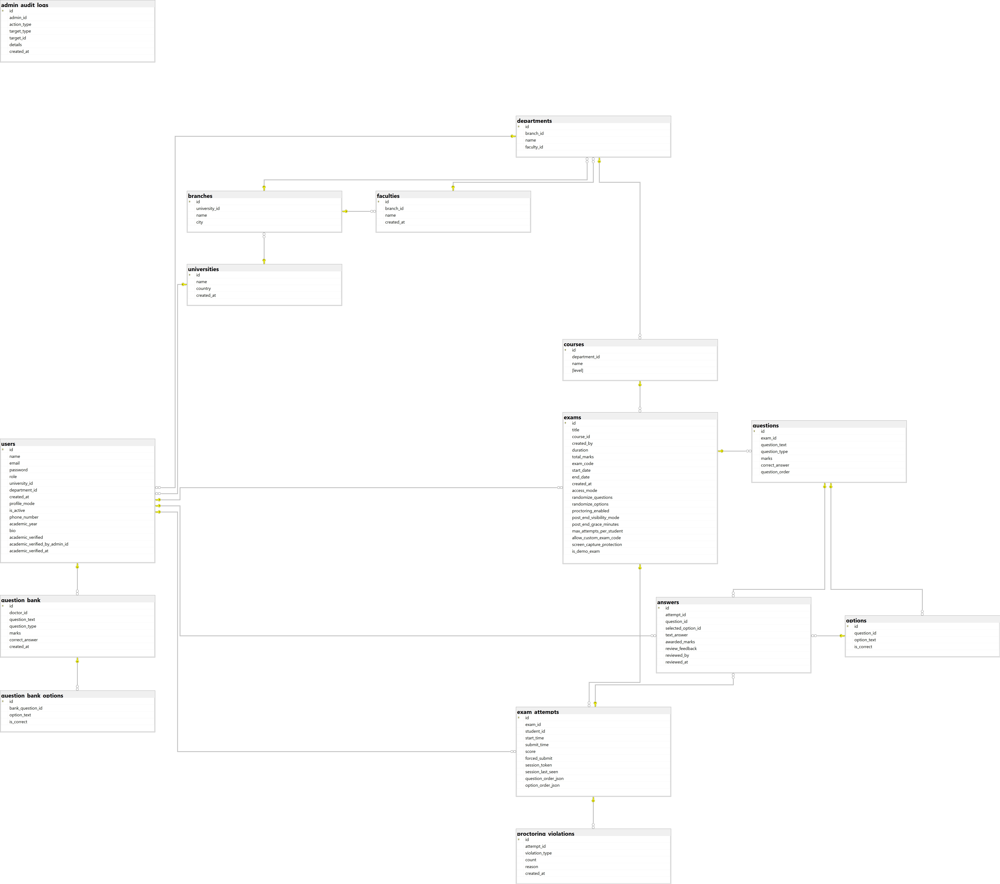

# 🚀 Examor — Online Examination Platform

A full-stack, production-ready online examination system with real-time proctoring, built using modern serverless architecture.

---

## 🌍 Live 

🔗 Frontend:
https://examor-frontend.vercel.app

🔗 Backend API:
https://examor-backend.vercel.app

---

## 🎯 Overview

**Examor** is a secure and scalable examination platform designed to simulate real-world exam environments.

It supports three roles:

* 👨‍🎓 Student
* 👨‍🏫 Doctor
* 🛠️ Admin

The system focuses on **exam integrity, performance, and real-time control**.

---

## 🧠 Key Features

* Real-time proctored exams (camera + fullscreen)
* Session lock (single device enforcement)
* Auto-save system & heartbeat tracking
* Role-based dashboards (Admin / Doctor / Student)
* Question bank & exam management
* Manual grading for essay questions
* Results & performance tracking

---

## 🔐 Security & Anti-Cheating

* Fullscreen enforcement
* Camera monitoring
* Tab switching detection
* Copy/paste blocking
* Violation tracking system
* Auto-submit on suspicious behavior
* Session-based exam locking

---

## ⚙️ Tech Stack

### Frontend

* React 19
* React Router 7
* Axios
* i18next

### Backend (Serverless)

* Node.js (Vercel Functions)
* Express.js

### Database

* PostgreSQL (Supabase)
* Microsoft SQL Server

### Security

* JWT Authentication
* Rate Limiting

---

## 🏗️ Architecture

```
Client (React)
   ↓
Serverless API (Vercel)
   ↓
PostgreSQL Database (Supabase)

```

## 🗄️ Database Design

The following diagram represents the core database structure of the system:



This ERD illustrates the relationships between users, exams, questions, attempts, and proctoring data, reflecting a real-world scalable system design.

---

## 🚀 Deployment

* Frontend: Vercel
* Backend: Serverless (Vercel)
* Database: Supabase (PostgreSQL)


---

## 🧠 Why This Project Stands Out

Unlike typical academic projects, Examor implements:

* Real-time proctoring system
* Session-based exam integrity control
* Serverless scalable backend
* Fully deployed production environment

---

## 👨‍💻 Author & Development

**Kareem Basem Fathi**

* Solo Project
* Development started: **10 March 2026**
* Designed, developed, and deployed end-to-end by a single developer

This project reflects strong skills in:

* Full-stack development
* System design
* Security implementation
* Real-world problem solving

---

## ⭐ Final Note

Examor started as a graduation project — and evolved into a production-level system.

If you find it interesting, feel free to ⭐ the repository.
